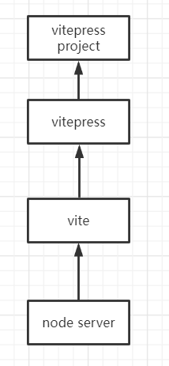

# vitepressdemo 项目总览
### 项目技术栈

```
    vite + vue + md
```

### 项目结构

```
docs
    .vitepress
        config.ts(vitepress site config)
        config dir
            md router map
            md plugin
        theme
    public(assets)
    write、docs/components(customize)
        md file
packages
    components source code
```

### 项目心得：

```
1. 通过vitepress提供的初始化hook，全局注册Demo组件、自定义组件
2. 执行vite.config.js，访问到md时，使用文件名作为id检索example文件夹下id路径下的vue文件，并通过script标签存到demos变量`。（此时修改了md源文件并未做解析）
3. 执行vitepress config.js，通过提供的markdown hook，使用markdown-it解析md。（此时对md做了解析并最终修改了源文件）
解析过程： 当md存在demo容器变量名时，检查渲染tokens，将demo容器块内部的text提取为source file path，通过fs访问example文件夹下对应路径下源文件，字符串存至source变量
4. 在md渲染时机，注入字符串，内容为`Demo组件注入source和变量demos`
```

# vitepress 源码心得:

### dev 环境

```
vitepress是在vite基础搭建的，在vite plugin基础上添加vitepress plugin.
1. 读取vitepress userconfig、sitedata等config配置项，使用vite提供的dev-server创建http server，并挂载vitepress plugin
2. vitepress plugin内处理md类型文件，配置server提供入口html，其中引入client/app/index.js
3. vite提供转换功能，将用户项目文件中涉及到相对路径的url转为/@fs/开头的绝对路径，以期望通过http访问, 最终由http server处理.
4. request handler中，经由vite:resolve plugin transform处理/@fs/路径url，并读取路径下的文件内容<string>
5. 源文件中的引用经由vite:import-analysis plugin transform, 过程中对路径加/@fs/
```

### server 流程

```
启动server流程：
	vitepress解析config配置后，提供viterpess plugin介入vite的plugin处理流程，最终通过node/http模块提供http server服务器供dev调试。
server serve流程：
	请求/, 返回index.html，内联js文件，再次发起http req get请求。
	middleware处理请求req
	req请求经过vite middleware，对req url做转换，
	resolve req url得到url，得到绝对路径path
	load module( 转换vue、md文件，node read file)
	transform:
	处理对文件路径引用的处理, 通过vite:import-analysis的transform将源文件中的/@fs/路径转为实际绝对路径, 通过vite:alias处理别名
	以上action通过vite、vitepress的plugin同名方法处理。
	最终返回转换后的源文件code中的外部引用url都以/@fs/开头
```

### vite plugin

```
vite:import-analysis
    transform method将路径转为/@fs/开头的实际文件路径, 重写源文件
vite:resolve
    resolve method分解/@fs/开头的路径;处理相对路径为绝对路径
vite:pre-alias：
    resolve method处理别名为实际文件路径
vite:optimized-deps:
    load deps file
vitepress plugin:
    转换vue、md文件为js文件；配置http server服务器的middleware，返回初始的入口页面
```

### vite middleware handle request url progression step

```
1. resolve req url
2. load source file
3. transform source file
    3.1 resolve imports id to urls
    3.2 rewritten import path by resolve url
    3.3 set http request about resolve url
```

### resolve url example

```
"/node_modules/.vite/deps/vue.js?v=23be0ae3"(vue)
"/@fs/C:/Users/EDZ/Desktop/vitepress/dist/client/theme-default/index.js"("@theme/index")
"/@fs/C:/Users/EDZ/Desktop/vitepress/dist/client/app/utils.js"("./utils.js")
"/@fs/C:/Users/EDZ/Desktop/vitepress/dist/client/app/router.js"("./router.js")
"/@fs/C:/Users/EDZ/Desktop/vitepress/dist/client/app/data.js"("./data.js")
"/@fs/C:/Users/EDZ/Desktop/vitepress/dist/client/app/composables/head.js"("./composables/head.js")
```

# github page 部署心得：

### 创建 github 同名仓库[repo]

形如`[name]/github.io`。 name 为 github username，每个账户仅有一个，用作 github page 个人域名。
该仓库文件可通过`[name]/github.io/`url 访问, 一般不存放。转为为每个仓库做部署.

### 每一个仓库拥有在线访问地址

访问`[name]/github.io/账户下的仓库名`

### repo->setting 为仓库设置访问分支

deploy branch 设置提供 server 的 branch，存放构建完的 dist 目录文件

### vitepress 中正式环境设置 baseurl 为仓库名

否则`[name]/github.io/账户下的仓库名`只访问到 index html, 访问不到包括样式等静态资源。

### 自动部署

通过官方提供的 github workflow 脚本实现, 提交更改后执行部署。
